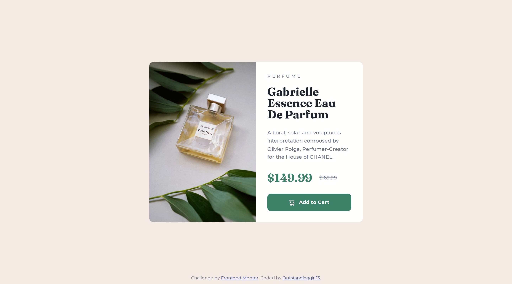

# Frontend Mentor - Product preview card component solution

This is a solution to the [Product preview card component challenge on Frontend Mentor](https://www.frontendmentor.io/challenges/product-preview-card-component-GO7UmttRfa). Frontend Mentor challenges help you improve your coding skills by building realistic projects. 

## Table of contents

- [Overview](#overview)
  - [The challenge](#the-challenge)
  - [Screenshot](#screenshot)
  - [Links](#links)
- [My process](#my-process)
  - [Built with](#built-with)
  - [What I learned](#what-i-learned)
  - [Useful resources](#useful-resources)
- [Author](#author)


## Overview

### The challenge

Users should be able to:

- View the optimal layout depending on their device's screen size
- See hover and focus states for interactive elements

### Screenshot



### Links

- Solution URL: [Add solution URL here](https://your-solution-url.com)
- Live Site URL: [GitHub Pages](https://outstandinggirl13.github.io/product-preview-card-component-main/)

## My process

### Built with

- Semantic HTML5 markup
- CSS custom properties
- Flexbox

### What I learned

Here’s a list of challenges I’ve come across so far while working on this project, along with how I tackled them:

1. **Dealing with how to position section element**

I used a pretty straightforward way to position the section in the middle of the screen:
```css
section {
    margin: calc((100vh - 28.125rem) * 0.5) auto;
}
```
What keeps the element centered along the y-axis are equal top and bottom margins that are calculated as ```(100vh - 28.125rem) * 0.5```, where ```28.125rem``` is the height of the section element. Also, in order to keep the element centered horizontally I used a well-known and popular value ```auto``` with ```margin``` property. As a result, the margins adjust based on the browser window size, ensuring the section element remains centered regardless of the window's dimensions. I believe this makes the webpage more responsive on larger screens, but at the same time, it causes some issues on mobile devices (see paragraph 5.2).

2. **Looking for a way to make a div element with the class .attribution, which plays the role of a footer, stick to the bottom of the page and remain visible**

Since the ```<section>``` element, including its margins, takes up all the available vertical space in the viewport, I needed to find a way to display the footer on top of the section. If the footer remains part of the document flow, you'll need to scroll down to see it. Because this page is rather minimalistic, I would like it to be equal to the screen size, without any scrolling needed.
To deal with the issue, the following approach was taken:
```css
.attribution { 
    position: fixed;
    bottom: 0;
}
```
```position: fixed;``` takes the element out of document flow and ```bottom: 0;``` ensures that it will stick to the bottom. 

3. **Splitting the section into two rows that contain the product image and product description**

For that, I used the Flexbox, although, I am still learning about the technology and I don't know all the nuances, this approach seems reasonable to me and the most convenient in this case.
```css
section {
    display: flex;
    flex-direction: row;
}
```
And then I set
```css
.product-description {
    width: 50%;
}
```
to make the div element with ```.product-description``` class precisely equal to half of the section element.

4. **Switching to more responsive units**

I've learned that one of the ways to be confident that the page looks like it is supposed to in all browsers with different user settings and sizes of screens is to use more responsive units like rem or % instead of px. Therefore, where appropriate, I replaced units with ```rem``` (mainly for font sizes, margins, and paddings) and ```%``` (for width and height).

5. **Fixing a messed up footer on mobile devices.**

5.1 To ensure that a div element with class ```.attribution``` won't have a width smaller than the section element in mobile design, I assigned the following property to it: 
```css
.attribution { 
    min-width: 21.5rem;
}
```
This helped prevent any unexpected behavior on smaller devices.

5.2 My solution for centering the ```<section>``` element was designed with large screens in mind. However, when the screen height is too small, the webpage looks awkward, and the calculated margin becomes negative. For example, on the iPhone SE, the footer overlaps the ```<section>``` element.


In this case, two media queries are applied. The first targets screens with a width of less than 648px and contains CSS code for mobile devices. The second applies to screens with a height of less than 720px and a width under 648px. This second media query addresses the footer issue by setting fixed top and bottom margin values and changing the footer's position to static:
```css
    section {
        margin: 2rem auto;
    }

    .attribution { 
        position: static;
    }
```
This prevents the footer from overlapping the ```<section>``` element and ensures it remains part of the document flow. With these adjustments, the webpage on the iPhone SE looks much better, although now you need to scroll down to see the attribution.

Initial screen displayed when the user enters the webpage on the iPhone SE:


Full-size screenshot on the iPhone SE:


5.3 The same issue occurs on screens with smaller heights. For example, on the Samsung Galaxy A51/71 in landscape mode, the CSS rule margin: calc((100vh - 28.125rem) * 0.5) auto; produces the following result:


To resolve the issue, I added an additional media query:
```css
@media (max-height: 34rem) {

    section {
        margin: 2rem auto;
    }

    .attribution { 
        position: static;
    }
}
```
Initial screen displayed when the user enters the webpage on the Samsung Galaxy A51/71:


Full-size screenshot on the Samsung Galaxy A51/71:


### Useful resources

- [Positioning - MDN](https://developer.mozilla.org/en-US/docs/Learn/CSS/CSS_layout/Positioning) - This helped me to understand ```position:fixed```.
- [Font-size - MDN](https://developer.mozilla.org/en-US/docs/Web/CSS/font-size) - Thanks to this article, I gained a clearer understanding of the differences between units.
- [CSS media queries](https://developer.mozilla.org/en-US/docs/Web/CSS/CSS_media_queries) and [Using media queries](https://developer.mozilla.org/en-US/docs/Web/CSS/CSS_media_queries/Using_media_queries) - For a better understanding of how to use media queries in responsive design.


## Author

- Website - [Outstandinggirl13](https://github.com/Outstandinggirl13)
- Frontend Mentor - [@Outstandinggirl13e](https://www.frontendmentor.io/profile/Outstandinggirl13)